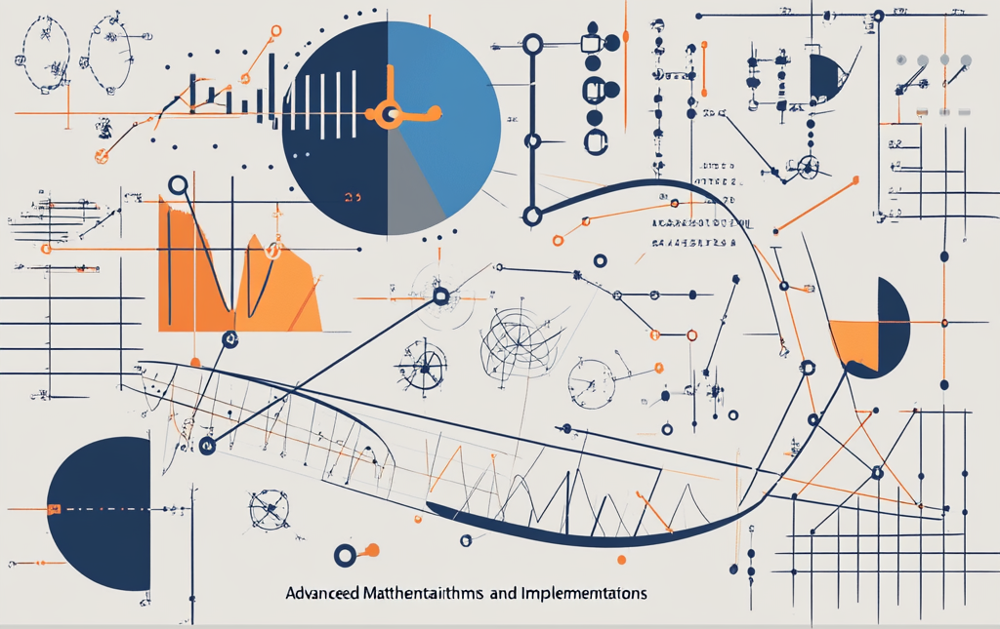

# Advanced Mathematical Algorithms and Implementations



This project contains a collection of Python implementations for solving advanced mathematical problems. These implementations are part of a series of assignments focusing on topics such as interpolation, numerical integration, curve fitting, and root finding. The project demonstrates various mathematical techniques applied to complex functions, including noisy data handling, efficient algorithm design, and custom mathematical models.

## Overview

The project is divided into multiple assignments, each addressing a different mathematical problem. My contributions include designing and implementing efficient algorithms to solve these problems with a focus on accuracy and performance.

### Assignment 1: Function Interpolation
- **Objective:** Interpolate a given function over a specified range using a minimal number of points, focusing on minimizing interpolation error.
- **Techniques Implemented:** 
  - **Cubic Spline Interpolation:** Developed a cubic spline interpolation method, ensuring smooth transitions between data points.
  - **Thomas Algorithm:** Implemented the Thomas algorithm to solve tridiagonal systems efficiently, which is critical for cubic spline interpolation.
- **File:** `assignment1.py`

### Assignment 2: Finding Intersections
- **Objective:** Calculate the intersection points of two functions within a specified range.
- **Techniques Implemented:** 
  - **Newton's Method:** Designed and implemented an optimized version of Newton’s method to quickly converge to intersection points.
  - **Bisection Method:** Combined with Newton’s method to ensure robustness, particularly in cases where Newton’s method alone might fail.
- **File:** `assignment2.py`

### Assignment 3: Numeric Integration and Area Calculation
- **Objective:** Perform numeric integration of a function and calculate the area enclosed between two functions.
- **Techniques Implemented:**
  - **Simpson's Rule:** Applied Simpson’s rule for numerical integration to balance accuracy and computational efficiency.
  - **Handling Multiple Intersections:** Developed a custom approach to accurately calculate the area between functions, even with multiple intersection points.
- **File:** `assignment3.py`

### Assignment 4: Model Fitting with Noisy Data
- **Objective:** Fit a polynomial model to noisy data points sampled from a function, minimizing the mean squared error.
- **Techniques Implemented:**
  - **Polynomial Fitting:** Created a custom polynomial fitting algorithm using Vandermonde matrices to model noisy data accurately.
  - **Adaptive Sampling:** Implemented an adaptive sampling strategy to optimize data collection based on noise characteristics and time constraints.
- **File:** `assignment4.py`

### Assignment 5: Shape Contour Fitting and Area Calculation
- **Objective:** Fit a model to the contour of a given shape and calculate its area.
- **Techniques Implemented:**
  - **DBSCAN Clustering:** Utilized DBSCAN clustering to filter noisy contour points and improve the accuracy of shape fitting.
  - **Shoelace Theorem:** Applied the Shoelace theorem to calculate the area of the fitted shape, ensuring precision even with irregular contours.
  - **Radial Sorting:** Developed a custom radial sorting algorithm to order contour points for accurate area calculation.
- **File:** `assignment5.py`

## Custom Implementations

Throughout the project, several custom algorithms and utility functions were developed to address the unique challenges of each assignment:

- **`functionUtils.py`:** Includes decorators for function timing, invocation restrictions, and noise injection, all of which were crucial in optimizing and testing the algorithms.
- **`commons.py`:** Contains common mathematical functions and utilities, such as noisy function generators and custom mathematical models.
- **`sampleFunctions.py`:** Provides a set of predefined functions used to test the accuracy and robustness of the implementations across different scenarios.

## Key Achievements

- **Optimized Performance:** Developed efficient algorithms that balance accuracy and performance, meeting stringent time constraints for real-time data processing.
- **Robust Handling of Noisy Data:** Implemented strategies for dealing with noise in data, ensuring reliable model fitting and interpolation results.
- **Complex Function Handling:** Successfully managed functions with multiple intersection points and complex contours, demonstrating the versatility and reliability of the algorithms.

## Installation

1. **Clone the repository**
   ```bash
   git clone https://github.com/omriarie/Numeric-Analisys.git
   
   ```


2. **Navigate to the project directory**
   ```bash
   cd Numeric-Analisys

   ```

3. **Install dependencies**
   ```bash
   pip install numpy matplotlib

   ```

## Running the Assignments  
For testing specific functions or components, you can also use the included test cases in grader.py:
```bash
   python grader.py
```

## Project Structure

- **`assignment1.py`:** Interpolation of functions using custom cubic splines and the Thomas algorithm.
- **`assignment2.py`:** Calculation of intersection points using Newton's method and Bisection.
- **`assignment3.py`:** Numeric integration and area calculation using Simpson's rule.
- **`assignment4.py`:** Model fitting for noisy data using polynomial fitting and adaptive sampling.
- **`assignment5.py`:** Contour fitting and area calculation using DBSCAN clustering and the Shoelace theorem.
- **`commons.py`:** Common utility functions and sample data generators.
- **`functionUtils.py`:** Utility decorators and base classes for mathematical operations.
- **`sampleFunctions.py`:** Predefined functions for testing assignments.
- **`grader.py`:** Automated grading script for testing and evaluating the assignments.

Each of these files serves a specific purpose in the project, showcasing various techniques and algorithms applied to different mathematical problems. The `commons.py` and `functionUtils.py` files provide foundational support across all assignments, while `grader.py` is used to automate testing and evaluation of the solutions.

The project structure is designed to be modular, allowing each assignment to be independently executed and tested, while sharing common utilities and testing frameworks.


## Contact
For any inquiries or issues, please open an issue on the GitHub repository or contact the maintainers directly:

Omri Arie – omriarie@gmail.com  
Project Link: https://github.com/omriarie/Numeric-Analisys
